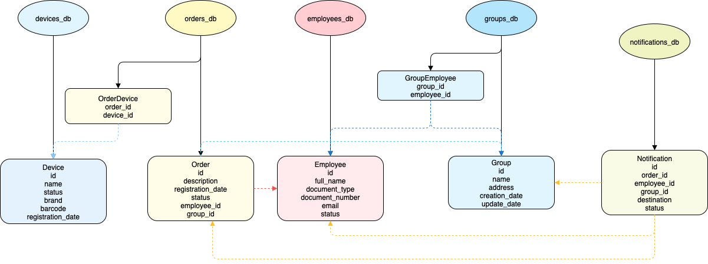
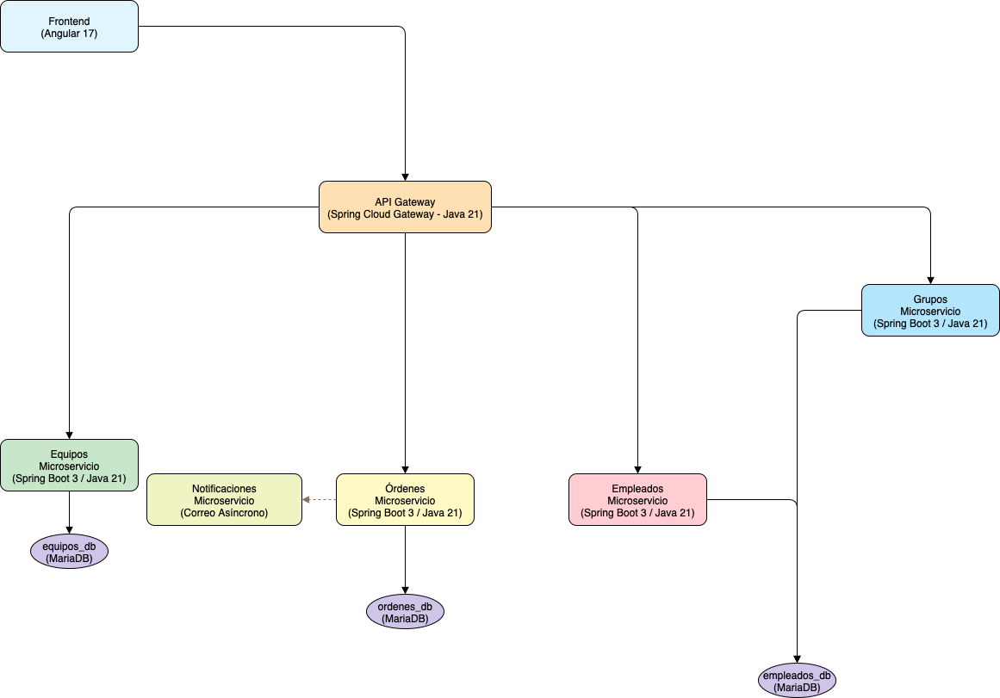

# InfraDeploy

This repository allows you to launch the entire InfraGest platform using Docker Compose.

## Getting Started

1. **Clone this repository:**
   ```bash
   git clone https://github.com/bunnystring/infra-deploy.git
   cd infra-deploy
   ```

2. **Clone each microservice into the corresponding folder:**
   ```bash
   git clone https://github.com/bunnystring/infra-config-server.git infra-config-server
   git clone https://github.com/bunnystring/infra-devices-service.git infra-devices-service
   git clone https://github.com/bunnystring/infra-orders-service.git infra-orders-service
   git clone https://github.com/bunnystring/infra-groups-service.git infra-groups-service
   git clone https://github.com/bunnystring/infra-notifications-service.git infra-notifications-service
   git clone https://github.com/bunnystring/infra-api-gateway.git infra-api-gateway
   git clone https://github.com/bunnystring/infra-frontend.git infra-frontend
   ```

3. **Database initialization scripts**

   Place all your database initialization scripts in the `initdb/` folder.  
   All `.sql` files inside this folder will be automatically executed when the database container (`infra-db`) is started for the first time.

4. **Start all services:**
   ```bash
   docker-compose up --build
   ```

## Architecture Diagrams

Below you will find the main architecture diagrams for InfraGest. These files are included in this repository for reference:

- **Entity Relationship Diagram:**  
  

- **Microservices Architecture Diagram:**  
  

## Expected Structure

```
infra-deploy/
  ├── docker-compose.yml
  ├── README.md
  ├── initdb/
  ├── diagrama-er.drawio.png
  ├── arquitectura-microservicios.drawio.png
  ├── infra-config-server/
  ├── infra-devices-service/
  ├── infra-orders-service/
  ├── infra-groups-service/
  ├── infra-notifications-service/
  ├── infra-api-gateway/
  └── infra-frontend/
```

> **IMPORTANT:**  
> The folder names must match exactly, so Docker Compose can build the images correctly.

## Updating Services

If you update any microservice, just run `git pull` inside the corresponding folder and restart the environment.

```bash
cd infra-devices-service
git pull
cd ..
docker-compose up --build
```

## Troubleshooting

- Make sure all repositories are cloned in the correct folders.
- Place your database scripts in the `initdb/` folder.
- Use `docker-compose down -v` to stop and remove all containers and volumes if you want a clean start.
